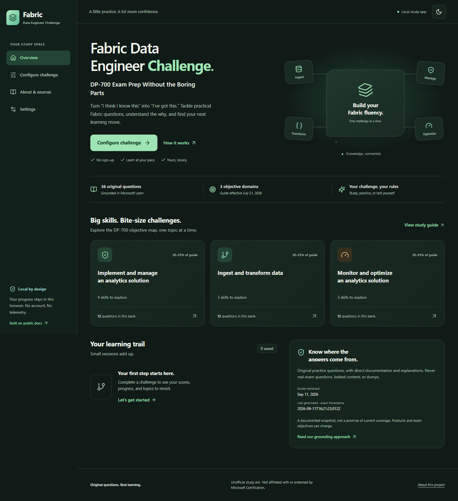

# Fabric Data Engineer Challenge

**DP-700 Exam Prep Without the Boring Parts**

A browser-based, documentation-grounded trivia app for practicing data engineering with
Microsoft Fabric. Configure a challenge, work through original questions, learn
why each alternative does or does not fit, and turn actual missed topics into a
focused study plan.

**Unofficial study aid. Not affiliated with or endorsed by Microsoft
Certification. This is not an official practice exam.**

## Launch in your browser

**[Launch Fabric Data Engineer Challenge](https://marcbushong.github.io/DP-700-Exam-Prep-Game/)**

The app is live on GitHub Pages. This repository is public, so a GitHub Pro
upgrade is not required to host it. The app and its bundled question bank are public.

Open the link in a modern desktop or mobile browser with JavaScript
enabled. The entire app runs in your browser: challenge setup, quizzes, scoring,
review, settings, and result downloads. No installation, Node.js, account, API key,
or Azure subscription is needed to play. Study progress stays in your browser's
local storage, not on GitHub. Loading the app requires internet access.

## Run locally or develop

Install **Node.js 22 LTS (22.12 or newer)** and npm, then run from this repository:

```powershell
npm install
npm run dev
```

Open the local URL printed by Vite (normally [http://127.0.0.1:5173](http://127.0.0.1:5173)).
No account, API key, database, Azure subscription, Docker, or environment
variables are required. Initial dependency installation needs internet access.
The quiz itself uses bundled content and does not call an AI service.

**Grounded on September 11, 2026**, against the **July 21, 2026** DP-700 study
guide. Exact retrieval and review timestamps are in
[`src/data/grounding-manifest.json`](src/data/grounding-manifest.json);
the app also displays its grounding date. This bank is versioned, **not always
current**. Product behavior and exam objectives change.

## Screenshot



Actual locally running application. Light and system themes are available in Settings.

## Features

- Single-select, multi-select, true/false, scenario, and code interpretation.
- Beginner through expert difficulty, plus adaptive practice.
- Concept recall, implementation, scenarios, troubleshooting, and architecture.
- Select all, one, or several domains, specific skills/subskills, or weak topics.
- Random, study-guide, weakest-first, and weighted exam-style question order.
- Immediate answers, explanations only, deferred answers, study coaching, and exam mode.
- Optional per-question or full-session countdown; flags and unanswered questions.
- Technical explanations, individual distractor rationales, and direct Learn citations.
- Score breakdowns by domain, skill, subskill, difficulty, and complexity.
- Evidence-based recommendations, missed-question retries, and weak-area practice.
- JSON and printable HTML result exports, and locally saved recent results.
- Unseen-question preference, concept diversity, and a separately resettable question history.
- Contextual host reactions with Full, Balanced, Reduced, and No Banter settings.
- Dark/light/system themes, reduced motion, and keyboard operation.

The bank contains **162 independently reviewed, verified playable questions**:
**54 per objective domain**, with **30 Beginner, 42 Intermediate, 54 Advanced,
and 36 Expert** questions. Advanced and Expert make up **55.6%** of the bank.
There are **0 manual-review-required, rejected, or stale** records in this revision.
All **10 skills and 54 measured subskills** have at least one primary question;
that is sampled coverage, not exhaustive mastery or an exam-readiness guarantee.

Last Learn MCP grounding: **2026-09-11T17:57:55.860Z**. Latest independent review
finalization: **2026-09-11T18:30:09.514Z**. Source and question records preserve
their individual real retrieval/review times. See the
[readable coverage report](docs/content-coverage.md) and
[machine-readable report](docs/question-bank-report.json) for distributions,
source counts, editorial warnings, and any future review queue.
The report keeps **124 nonblocking heuristic warnings across 92 verified
questions** visible for editorial inspection (for example, pronouns or scenario
negation). These were assessed in the independent reviews; they are not 92
unverified questions. This revision has no blocking duplicates or citation errors.

Filters may produce fewer questions than requested; setup shows the available
number before starting. Questions and concept IDs are not duplicated to fill a
quota. Weighted selection respects the current guide's domain ranges when
feasible and discloses constraints. This is not a reproduction of the certification exam.

## Stack and architecture

React 19, strict TypeScript, Vite, React Router, lightweight CSS, Lucide icons,
Zod, Vitest, React Testing Library, Playwright, and axe-core.

```text
src/
  components/             Shared accessible UI and documentation surfaces
  pages/                  Landing, setup, play, results, review, settings, about
  features/
    grounding/            Runtime content schemas and taxonomy extraction
    quiz/                 Pure selection/timing engine, state, configuration
    results/              Pure scoring and recommendations
  services/               Local storage and safe exports
  data/                   Versioned questions, source manifest, objective taxonomy
  styles/                 Responsive light/dark presentation
scripts/                  MCP retrieval and content validation/reporting
tests/                    Unit, interaction, and browser tests
docs/                     Coverage and maintainer documentation
.vscode/mcp.json           Microsoft Learn MCP connection
.github/copilot-instructions.md
```

The browser validates the question bank before mounting the quiz. UI, selection,
scoring, content validation, persistence, and exports are separate. Questions and
source metadata ship in the static bundle. There is no backend, URL proxy, live
model provider, or browser-to-MCP request.

## Commands

| Command                                | Purpose                                                                                           |
| -------------------------------------- | ------------------------------------------------------------------------------------------------- |
| `npm install`                          | Install dependencies from the manifest/lockfile                                                   |
| `npm ci`                               | Reproducible clean installation for CI                                                            |
| `npm run dev`                          | Local Vite development server                                                                     |
| `npm run lint`                         | ESLint, TypeScript rules, and React Hooks rules                                                   |
| `npm run typecheck`                    | Strict TypeScript checking                                                                        |
| `npm run test`                         | Unit and component tests, one run                                                                 |
| `npm run test:coverage`                | Unit coverage, including HTML in `coverage/`                                                      |
| `npm run test:e2e`                     | Chromium desktop/mobile browser journeys and accessibility                                        |
| `npm run validate`                     | Reject malformed, misaligned, duplicate, or uncited questions                                     |
| `npm run validate:sources`             | Offline citation and manifest validation                                                          |
| `npm run validate:sources -- --online` | Additionally check direct Learn sources online                                                    |
| `npm run content:report`               | Generate content coverage information                                                             |
| `npm run content:report -- --write`    | Update the checked-in coverage report                                                             |
| `npm run format`                       | Format source and documentation with Prettier                                                     |
| `npm run format:check`                 | Check formatting without modifying files                                                          |
| `npm run build`                        | Validate content, check types, and build `dist/`                                                  |
| `npm run preview`                      | Serve the production build locally                                                                |
| `npm run questions:generate`           | Scaffold a maintainer request and reusable Copilot prompts; does not generate questions by itself |
| `npm run questions:validate`           | Validate the bank, citations, objective mappings, and playable status                             |
| `npm run questions:coverage`           | Report verified-only coverage, targets, and gaps                                                  |
| `npm run questions:duplicates`         | Check exact/near duplicates and report editorial quality warnings                                 |
| `npm run questions:verify`             | Validate recorded independent reviews and content fingerprints, without inventing verification    |
| `npm run questions:report -- --write`  | Write readable and machine-readable question-bank reports                                         |

Install the browser once before running end-to-end tests:

```powershell
npx playwright install chromium
npm run test:e2e
```

On Linux CI, use `npx playwright install --with-deps chromium`.
Browser tests build the production app and start their own loopback-only Vite
preview instance at `/DP-700-Exam-Prep-Game/`, matching the GitHub Pages project
path. They cover launch, navigation, refresh, quizzes, exports, local storage,
and accessibility. Chromium is a test dependency, not a requirement for end users;
use a modern browser to study.

Production build:

```powershell
npm run build
npm run preview
```

Vite's preview server is for local inspection, not an internet-facing production
server. To distribute the static build, serve `dist/` using any static HTTPS host.
Relative asset URLs and hash navigation (such as `/#/setup`) support both a domain
root and a project subdirectory without server-side SPA rewrites. Do not open
`index.html` with `file://`. Docker is intentionally not included.

## GitHub Pages deployment

Deployment is enabled in [the Quality gates workflow](.github/workflows/ci.yml)
with the repository variable `PAGES_ENABLED` set to `true` and GitHub Pages
configured to use GitHub Actions. Making a repository public does not enable
Pages or publish the app by itself.

To restore hosting or configure a copy of this repository:

1. Use a public repository for GitHub Free, or an eligible paid plan for a private repository.
2. In repository **Settings > Pages > Build and deployment**, select **GitHub Actions** as the source.
3. In **Settings > Secrets and variables > Actions > Variables**, add a repository variable named `PAGES_ENABLED` with the value `true`. This is a deployment switch, not a secret or browser setting.
4. Open **Actions > Quality gates > Run workflow**, select `main`, and run it.
5. After **Deploy browser app** succeeds, open the site's URL shown in **Settings > Pages**. For this repository, it is the launch link above; copies need their own README launch URL.

Subsequent pushes to `main` publish automatically after the quality gates pass.
Pull requests and manual runs on other branches never deploy. Only the built
`dist/` files are deployed. GitHub hosts the static files, while all quiz execution
and study storage remain browser-side.
The workflow uses GitHub's deployment token, not a personal access token.

Routes can be bookmarked, for example
[challenge setup](https://marcbushong.github.io/DP-700-Exam-Prep-Game/#/setup).
Saved results are available only in the browser profile that created them.
Local development and the hosted site use separate browser storage; local results
do not automatically move to the hosted app. Reloading an unfinished quiz still
discards that in-memory session.

## Microsoft Learn MCP configuration

Open the repository in a current VS Code with GitHub Copilot Chat and MCP support.
The checked-in `.vscode/mcp.json` declares:

```json
{
  "servers": {
    "microsoft-learn": {
      "type": "http",
      "url": "https://learn.microsoft.com/api/mcp"
    }
  }
}
```

Use VS Code's **MCP: List Servers** command to inspect/start this server and
approve it if prompted. Tool names are discovered at connection time; the
current server advertises `microsoft_docs_search`, `microsoft_docs_fetch`, and
`microsoft_code_sample_search`.

The included **maintainer-only** CLI also uses the official MCP TypeScript SDK,
initializes a Streamable HTTP connection, lists tools, and calls the discovered
documentation tool. No authentication or secret is needed for this public
server. See the official [MCP overview](https://learn.microsoft.com/en-us/training/support/mcp)
and [developer reference](https://learn.microsoft.com/en-us/training/support/mcp-developer-reference).

Do not navigate to the MCP endpoint as a web page or add a browser fetch
workaround; a normal browser GET can return 405.

## Grounding, not runtime generation

Copilot retrieved the authoritative guide, certification, course, and supporting
documentation through Microsoft Learn MCP. Original questions were then written
from the retrieved evidence and linked to source records. **MCP retrieves
documentation; it does not generate questions.**

Raw MCP responses are kept in the ignored `.grounding/` maintainer workspace,
not embedded in the app. Versioned manifests preserve citations, retrieval and
review timestamps, objective alignment, feature status, and short paraphrased
supporting summaries. The application runs on that reviewed bank, not live
runtime generation. There is no configured or enabled dynamic provider.

Generation and verification are separate passes. An author first creates a
candidate from retrieved documents. A different reviewer then evaluates the
finished scenario, each answer choice, the explanations, code, constraints, and
feature status against the evidence. The committed
[`verification-reviews.json`](src/data/verification-reviews.json) records those
reviews and fingerprints the exact reviewed content. A changed answer, scenario,
or citation requires another review; a successful build cannot silently reuse
the old attestation.

Only `verified` questions with complete, current review metadata enter gameplay.
`manual-review-required`, `rejected`, and `stale` questions remain excluded.
Newer source-review timestamps make affected questions stale until re-reviewed.
Freshness is change-driven, not a guarantee that a fixed-age question is correct:
maintainers still need to retrieve current documentation and record changes.

Structural validation cannot prove a technical explanation is true. Online
validation proves reachability, not agreement with a claim. Maintainers must
read the retrieved passages and review **both the correct answer and every
distractor**. Unclear or conflicting evidence means excluding a question, not
inventing a resolution. Preview-dependent questions must be labelled Preview.

## Refreshing the guide and bank

1. Start a Copilot content-refresh session and follow `.github/copilot-instructions.md`.
2. Retrieve the latest guide, certification, and course through Learn MCP.
3. Extract a candidate taxonomy; compare effective dates, domains, weights, skills, and subskills.
4. Search for direct product documentation and fetch full supporting pages, including code samples when applicable.
5. Review affected questions, paraphrase evidence, and update manifests and validation dates only for content actually reviewed.
6. Run all content checks, regenerate the coverage report, and review the diff before committing.

Copy-ready retrieval examples (use new output names on subsequent refreshes):

```powershell
npm run grounding:retrieve -- fetch "https://learn.microsoft.com/en-us/credentials/certifications/resources/study-guides/dp-700" ".grounding\guide-refresh.json"
npm run grounding:retrieve -- fetch "https://learn.microsoft.com/en-us/credentials/certifications/fabric-data-engineer-associate/" ".grounding\cert-refresh.json"
npm run grounding:retrieve -- fetch "https://learn.microsoft.com/en-us/training/courses/dp-700t00" ".grounding\course-refresh.json"
npm run grounding:taxonomy -- ".grounding\guide-refresh.json" ".grounding\objectives.candidate.json"
npm run grounding:retrieve -- search "Microsoft Fabric lakehouse table maintenance OPTIMIZE" ".grounding\maintenance-search.json"
npm run grounding:retrieve -- code "Microsoft Fabric PySpark Delta table maintenance" ".grounding\maintenance-code.json"
npm run validate
npm run validate:sources -- --online
npm run content:report -- --write
```

Retrieval scripts refuse to overwrite evidence files. Taxonomy extraction fails
if expected study-guide headings change; inspect the current source and update
the parser deliberately. A new candidate does **not** automatically replace the
active taxonomy or certify existing content against changed objectives.

The certification/course pages can contain client-rendered training placeholders.
Use Learn search to retrieve the actual relevant self-paced paths/modules;
never invent content from a `Loading...` placeholder.

## Adding a question

Read the [question-bank maintenance guide](docs/question-bank-maintenance.md)
and `src/features/grounding/schema.ts`. Start a small, reviewable batch:

```powershell
npm run questions:generate -- --author maintainer --count 6 --output ".grounding\next-batch"
```

This creates a machine-readable request and copies the
[generation](.github/prompts/generate-dp700-questions.prompt.md) and
[independent verification](.github/prompts/verify-dp700-questions.prompt.md)
prompts. Run them with Copilot and the Microsoft Learn MCP server after retrieving
the primary pages and supporting articles. The command itself is deterministic
scaffolding, not an AI generator. Input/output schemas are in [`schemas/`](schemas/).
There is no paid runtime model dependency and no credential belongs in the browser.

Keep candidates excluded until a separate reviewer has completed the per-option
attestation. Merge reviewed questions, source records, and their attestations
together, then run:

```powershell
npm run questions:validate
npm run validate:sources -- --online
npm run questions:duplicates
npm run questions:verify
npm run questions:coverage
npm run questions:report -- --write
npm run test
npm run build
```

Reports include the review queue and reasons for excluded content. Review or
remove unsupported claims instead of changing a status just to make a check pass.

| Field                                            | Requirement                                                              |
| ------------------------------------------------ | ------------------------------------------------------------------------ |
| `id`, `question`                                 | Unique stable ID and original applied question text                      |
| `questionType`                                   | `single-select`, `multi-select`, `true-false`, `scenario`, or `code`     |
| `answerChoices`                                  | Two to six distinct `{ id, text }` choices                               |
| `correctAnswer`                                  | Array of choice IDs; one except for multi-select                         |
| `explanation`, `deepExplanation`                 | Concise explanation and deeper technical rationale                       |
| `whyOtherAnswersAreWrong`                        | Object keyed by **every distractor ID**, and no correct IDs              |
| `objectiveDomain`, `skill`, `subskill`           | Exact IDs/text from `objectives.json`                                    |
| `difficulty`                                     | `beginner`, `intermediate`, `advanced`, or `expert`                      |
| `complexity`                                     | One of the five values in the schema; `mixed` is a session setting       |
| `sourceIds`, `sourceUrls`, `documentationTitles` | Nonempty, aligned one-to-one with manifest records                       |
| `generatedAt`, `lastValidatedAt`                 | Actual ISO 8601 UTC timestamps                                           |
| `featureStatus`                                  | `GA` or `Preview`                                                        |
| `tags`                                           | Nonempty descriptive topic tags                                          |
| `codeLanguage`, `codeSnippet`                    | Required together for code questions                                     |
| `conceptId`                                      | Stable identifier for the factual concept, not a renamed scenario        |
| `verificationStatus`, `requiresManualReview`     | Only `verified` with `false` is eligible for normal gameplay             |
| `verifiedAt`, `sourceLastReviewedAt`             | Actual independent-review time and the latest cited source-review time   |
| `verifiedAgainstSourceIds`                       | Exact set of cited source IDs covered by the review                      |
| `verificationNotes`, `confidenceReason`          | Evidence-specific reasoning, not a model-generated confidence percentage |

Sources require `sourceId`, title, direct HTTPS `learn.microsoft.com` URL,
retrieval/review dates, applicable domain and skill IDs, feature status, and
supporting summary. No search URLs, arbitrary external hosts, ambiguous preview
status, empty citations, or guide-only evidence for product behavior.

Duplicate checks normalize text and choice ordering, inspect code similarities,
and compare concept IDs. Editorial warnings also identify answer-length bias,
repeated positions/openings, negative wording, absolutes, and possible semantic
overlap. These heuristics cannot establish semantic uniqueness or factual truth:
the independent reviewer must adjudicate them against the actual documentation.
Never rename a concept ID merely to evade a warning.

## Scoring and adaptive practice

A correct answer earns **1 point**; incorrect or unanswered earns **0**.
Multi-select earns credit only for the exact complete set, without duplicates.
There is no partial credit and no time-based penalty or bonus. Scores are local
practice percentages, **not Microsoft's scaled certification scores**.

Timers use elapsed wall-clock time, so background-tab interval throttling cannot
extend a deadline. Per-question expiry locks that question as unanswered.
Full-session expiry completes the session and leaves unvisited questions
unanswered. Submissions are locked and repeated timer events cannot duplicate
results. The full-session clock includes time spent viewing feedback.

Adaptive mode begins near Intermediate when fewer than three matching historical
responses are available. Otherwise it considers up to 20 recent matching
responses: each contributes its difficulty index plus one for a correct answer
or minus one otherwise, and the rounded mean is clamped to the supported levels.
During play, three consecutive correct or incorrect responses at the same actual
difficulty move the target one level. Alternating outcomes do not move it after
each answer. The next question is the closest available difficulty within the
next planned domain's remaining preselected questions. This preserves domain
allocation; it does not add questions, override filters, or estimate calibrated
ability. Study-guide order may reorder skills within the planned domain when
adaptive practice is enabled.

Selection prevents repeated IDs and concept IDs within a session and prefers
questions outside the recent-question history when the available pool permits.
Weighted exam-style selection uses integer domain quotas within the study
guide's ranges when feasible. Small sessions, filters, or concept availability
can make that impossible; setup reports the limitation. Random order is not
advertised as domain-balanced, and seen questions are never permanently hidden.

Weak-area selection uses missed topics in the most recent 20 saved sessions.
No misses/history means a disclosed general-practice fallback. Results compare
only sampled topics. Categories with fewer than five questions carry a small
sample warning; a broader performance label requires at least 15 questions and
five in each current domain. Even this is **not an exam-readiness prediction**.

## Host personality

Settings offers **Full Banter**, **Balanced**, **Reduced Banter**, and **No Banter**.
The choice affects the entire host, not just correct-answer feedback. Technical
results, explanations, citations, and scoring never depend on the amount of humor.
Legacy reduced-banter preferences are migrated without discarding saved results.

Structured message pools use categories and metadata for domain, difficulty,
streak, tone, intensity, themes, and direct reduced-banter wording. Context
distinguishes ordinary answers, partial multi-select attempts, timeouts, recovery,
expert questions, documentation, retries, weak-area practice, and results.
Partial multi-select reactions do **not** introduce partial-credit scoring.
The catalog contains **196 reactions across 23 categories**, including 33 general
correct, 33 incorrect, 15 streak, 15 timeout, 20 session-completion, 10 documentation,
and 10 weak-area reactions, plus domain-specific and other contextual messages.

The selection engine remembers recent message IDs, openings, and joke themes,
and avoids repetition when alternatives exist. The default category-exhaustion
threshold is 80%, with bounded theme/opening windows and a finite small-pool fallback.
Balanced shows answer and summary reactions; Reduced uses mild wording every
fourth answer and in summaries; Full also enables contextual events; None disables
all reactions. Seeded tests make choices
reproducible; session boundaries reset message history. Screen-reader feedback
prioritizes the answer result and explanation, not a live announcement of the joke.
To add reactions, follow the typed catalog in `src/features/personality/`, assign
unique IDs and accurate context metadata, and include a mild direct alternative.
Keep humor out of technical definitions, code, and citations.

## Local data, privacy, and exports

Study preferences, the most recent **30 completed sessions**, and up to **200
recently shown question IDs** are stored under `fabric-challenge:v1` in this
browser's localStorage. Results include
question snapshots so later bank updates cannot silently rescore history.
In-progress quizzes are held in memory: **reloading loses an unfinished session**.
Question history records questions actually shown, not unused preselected items.
Use **Reset question history** in Settings to reset unseen-question preference
without removing saved scores or preferences. Retrying an older result uses the
matching currently verified bank entries, not obsolete historical answer keys;
historical review and scoring still use the original snapshots.

No telemetry, sign-in, cookies for tracking, external database, or third-party
model calls are enabled. LocalStorage is not encrypted; anyone using the same
browser profile may access these results. Private browsing and storage limits
can prevent persistence; the app displays failures rather than pretending a
save succeeded. JSON exports contain your study answers and timestamps.

Use **Clear Local Data** in Settings to remove this application's saved settings
and results without deleting unrelated site storage. Downloaded exports are
separate files and must be removed yourself. Export JSON for structured data or
printable HTML for a readable report; open the downloaded HTML and use your
browser's Print command to print or save as PDF.

Opening a documentation link contacts Microsoft Learn using your browser.
The link is opened with `noopener noreferrer`. Browser content is rendered as
text/React, not arbitrary HTML; exports escape text and validate source URLs.
No environment variables are supported, so no `.env.example` is needed.
Never introduce secrets into frontend configuration.

## Accessibility

Semantic landmarks and headings, labelled native form controls, keyboard
navigation, visible focus, skip navigation, accessible dialogs, and textual
score breakdowns support assistive technologies. Correct/incorrect feedback
uses words and icons as well as color. Dark, light, system, forced-color, and
reduced-motion settings are supported. Banter can be disabled independently.

Browser journeys include automated axe checks for critical screens. Automated
checks do not replace manual screen-reader testing or constitute an accessibility
certification.

## Troubleshooting

| Symptom                            | Action                                                                                      |
| ---------------------------------- | ------------------------------------------------------------------------------------------- |
| Node/Vite syntax or engine error   | Use Node 22.12+; Node 22 LTS is recommended                                                 |
| `npm` is not found                 | Install Node and reopen the terminal                                                        |
| Port is in use                     | Use Vite's printed alternative port, or `npm run dev -- --port 5174`                        |
| Few or zero matching questions     | Broaden skill, format, difficulty, or domain filters                                        |
| Saved data warning                 | Export results, check browser storage permissions, then clear app data                      |
| Missing Playwright executable      | Run `npx playwright install chromium`                                                       |
| MCP returns 405 in browser         | Use Copilot MCP tools or the included SDK CLI, not browser navigation                       |
| MCP tool/schema changed            | Discover tools and review the client; do not fabricate successful output                    |
| Source check fails offline         | Retry when online; do not claim a fresh source review                                       |
| Invalid bank blocks startup/build  | Correct the reported schema, duplicate, taxonomy, or citation error                         |
| GitHub Pages launch link gives 404 | Enable Pages with GitHub Actions, set `PAGES_ENABLED=true`, and run Quality gates on `main` |
| Direct hosted route gives 404      | Use the app's hash link, such as `/DP-700-Exam-Prep-Game/#/setup`                           |
| Unfinished session disappeared     | Reload resets in-memory play; only completed results persist                                |

## Contributing, license, and limitations

Keep changes focused and accessible. Include engine/UI tests for behavior
changes and direct evidence for content changes. Run lint, typecheck, tests,
validation, browser journeys, and the production build before proposing a change.
CI applies the same quality gates.

Sampling every measured subskill does not exhaust its depth. Technical content
has a specific last-reviewed date and can go stale. There is no live content
refresh, cloud sync, account recovery, exam simulation guarantee, or supported
runtime AI provider. SQL/PySpark/KQL examples are teaching snippets, not executed
against a Fabric capacity by this app. Because this is a local client-side app,
the bundled answers can be inspected in developer tools; exam mode controls
feedback visibility, not proctoring or anti-cheating security.

**License guidance:** no project license has been selected. The repository owner
should choose and add a license before distributing the code or question bank.
Linked Microsoft documentation remains subject to its own terms. Microsoft,
Microsoft Fabric, Microsoft Learn, GitHub Copilot, and related marks belong to
their respective owners; this project does not grant rights to those marks.

Questions are original and based on public documentation. This application does
not contain actual exam questions, leaked questions, exam dumps, or copied
practice assessments. Verify answers through the linked Microsoft Learn pages.
